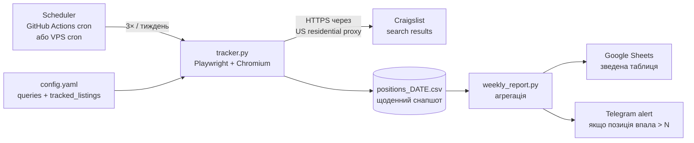

# Craigslist Position Tracker

Автоматизація ручного процесу менеджера: замість того, щоб кілька разів на тиждень заходити через VPN на Craigslist, шукати наші оголошення та руками виписувати їхні позиції — робимо це скриптом, складаємо тижневу зведену таблицю та (опційно) надсилаємо її в Google Sheets / Telegram.

> Це **тестове завдання для Supplax (AI Automation / AI Engineer)**, Частина 2.
> Кейс із власного досвіду (Частина 1) — див. [docs/case1_rag_assistant.md](docs/case1_rag_assistant.md).
> Фінальний PDF для здачі — [`Supplax_test_task_Valentyn_Petruk.pdf`](Supplax_test_task_Valentyn_Petruk.pdf).

---

## TL;DR що тут є

| Файл | Що робить |
|---|---|
| [`src/tracker.py`](src/tracker.py) | Headless-браузер (Playwright + Chromium) → US-прокси → проходить N сторінок видачі Craigslist → знаходить наші оголошення → пише позиції в CSV |
| [`src/weekly_report.py`](src/weekly_report.py) | Бере дневні CSV за тиждень → агрегує (avg / best / worst / delta / days_missing) → недільна зведена таблиця |
| [`src/ai_summary.py`](src/ai_summary.py) | **AI-шар.** Бере `weekly_report.csv` → Gemini (`gemini-flash-latest`) → human-readable звіт з 2-4 конкретними рекомендаціями менеджеру. ~$0.001 за запуск |
| [`src/config.yaml`](src/config.yaml) | Декларативний список запитів і наших оголошень (id + title_contains для матчингу) |
| [`src/generate_sample.py`](src/generate_sample.py) | Генерує демо-дані за 7 днів — щоб weekly_report + ai_summary можна було подивитися без US-IP |
| [`output/`](output/) | Готові CSV: 7 щоденних + `weekly_report.csv` |
| [`docs/architecture.md`](docs/architecture.md) | Концепція повної системи + ризики + наступні кроки |

---

## Концепція повної системи (як я б це довів до production)



Ключові рішення:

1. **Playwright > requests** — Craigslist рендерить результати JS-ом і часто показує challenge-сторінки для дата-центрових IP. Реальний браузер у headful/headless режимі з нормальним user-agent проходить набагато стабільніше.
2. **US residential proxy, не VPN** — VPN-діапазони (NordVPN/ExpressVPN) у Craigslist спалені і часто блокуються. Residential pool (BrightData / SOAX / SmartProxy) на порядок надійніший. Це **головний production-risk** усієї задачі.
3. **Декларативний config** — менеджер сам править YAML (запити + id оголошень). Не потрібен developer для додавання нового міста / ключового слова.
4. **CSV → SQLite / BigQuery** на масштабі — поки об'єм маленький, CSV у git або в Drive це нормально. Коли запитів стає 50+, переходимо на колонкове сховище.
5. **AI-шар поверху, не замість** — LLM не потрібен для самого скрейпінгу. Але **дуже корисний** для тижневого підсумку природньою мовою: "позиція впала на 5 пунктів через нові оголошення X, рекомендую перепостити Y". Це другий етап.

---

## Запустити за 30 секунд (без US IP, без API-ключа)

```bash
git clone https://github.com/xhoxe2/craigslist-position-tracker
cd craigslist-position-tracker
python3 -m venv .venv && source .venv/bin/activate
pip install pyyaml          # тільки це і потрібно для sample + report

python src/generate_sample.py     # 7 щоденних CSV у output/
python -m src.weekly_report       # output/weekly_report.csv
cat output/weekly_summary.txt     # готовий AI-summary (вже в репо)
```

## Запустити повністю (зі скрейпінгом і AI)

```bash
pip install -r requirements.txt
playwright install chromium
cp .env.example .env  # відредагуй: PROXY_SERVER (US residential)

# Реальний прогін на Craigslist
python -m src.tracker --config src/config.yaml

# AI-сумарі тижня (отримати ключ безкоштовно: https://aistudio.google.com)
export GEMINI_API_KEY=...
python -m src.ai_summary
```

Без US-прокси `tracker.py` все одно запуститься (це перевірено — є скрин у [`assets/`](assets/)), але Craigslist поверне сторінку "Your request has been blocked". CSV буде з усіма `position=""` (не знайдено) — без падіння.

---

## Приклад виходу

`output/positions_2026-05-25.csv` (щоденний снапшот):

| run_date | city | keyword | listing_id | position | page | url |
|---|---|---|---|---|---|---|
| 2026-05-25 | newyork | iphone 15 pro | 7700000001 | 6 | 1 | …/7700000001.html |
| 2026-05-25 | newyork | iphone 15 pro | 7700000002 | 13 | 1 | …/7700000002.html |
| 2026-05-25 | losangeles | macbook pro m3 | 7700000010 | 9 | 1 | …/7700000010.html |
| 2026-05-25 | chicago | office chair herman miller | 7700000020 |  |  |  |

`output/weekly_report.csv`:

| city | keyword | listing_id | runs | days_visible | days_missing | avg_position | best | worst | delta_first_to_last |
|---|---|---|---|---|---|---|---|---|---|
| newyork | iphone 15 pro | 7700000001 | 7 | 7 | 0 | 5.3 | 4 | 7 | +2 |
| chicago | office chair … | 7700000020 | 7 | 5 | 2 | 2.6 | 2 | 4 | +2 |

---

## Ризики, які я бачу в цій задачі

Детально розписано в [docs/architecture.md](docs/architecture.md), коротко:

1. **Geo + bot-detection.** Без US-IP видача спотворена або заблокована. VPN-діапазони палять. Production-рішення = residential proxy pool. Це **єдина обов'язкова платна залежність**.
2. **ToS Craigslist.** Скрейпінг формально проти умов. Мінімізуємо: розумний rate-limit (3× на тиждень, не щодня), реалістичний user-agent, ніяких розпаралелених сесій з одного IP, ніякої авторизації під фейковими акаунтами.
3. **Дрифт DOM.** Craigslist періодично змінює класи (`li.cl-static-search-result` ↔ `li.cl-search-result`). Селектори тримаємо в одному місці і покриваємо обома варіантами.
4. **Однакові тайтли в категорії.** Якщо два постера написали "iPhone 15 Pro 256GB Unlocked" — без id матчинг неточний. Тому матчимо **спочатку по id** (вибираємо з URL `/d/.../<id>.html`), і тільки потім fallback на `title_contains`.
5. **Капча.** Якщо вона з'являється — пишемо в лог `! capcha block`, кидаємо алерт у Telegram. Не намагаємось обходити автоматично — це межа, за яку production не повинен переступати без письмового погодження бізнесу.
6. **Точність позицій vs ціна.** "Позиція 11 на сторінці 1" в Craigslist майже еквівалентна "позиції 1 на сторінці 1" з погляду CTR — у видачі поверх скролу. Це треба погодити з менеджером: що саме рахується "хорошою" позицією. Без цього метрика суб'єктивна.

---

## Що я свідомо НЕ зробив у MVP (і чому)

- **Інтеграція Google Sheets.** Код-стаб є в `requirements.txt`, але я залишив CSV — він простіший для review і повністю замінюваний. Перехід — ~30 рядків через `googleapiclient.discovery.build("sheets", "v4")`.
- **Production-розсилка AI-сумарі.** Локальний скрипт `src/ai_summary.py` вже є і показує, як CSV перетворюється на human-readable рекомендації через Gemini. У production я б додав автоматичний weekly-run, логування якості перших запусків і доставку в Telegram / Google Sheets. Свідомо не робив повну delivery-інтеграцію в MVP, бо найдоцільніший стартовий фрагмент — сам скрейпер + тижнева агрегація.
- **Antidetect browser (Playwright stealth).** Поки rate-limit низький і прокси residential — не потрібно. Додаємо, коли блокують.

---

## Стек

| Шар | Інструмент | Чому |
|---|---|---|
| Браузер | Playwright + Chromium | API дружній, async, нативно тримає JS-рендер |
| Парсинг | вбудований `page.evaluate` | без зайвих залежностей типу BeautifulSoup |
| Конфіг | YAML | не-розробник може правити |
| Storage | CSV (etap 1) → Google Sheets / SQLite (etap 2) | дешево і прозоро |
| Scheduling | cron / GitHub Actions | без зайвої інфри |
| Anti-bot | US residential proxy | єдиний робочий шлях |
| AI-шар | LLM weekly summary (наступний крок) | пояснення трендів natural language |

---

## Автор

Валентин Петрук · `266mir@gmail.com` · [CV / Live demo](https://ai-automation-demo-hub.nobivoc.workers.dev/)
