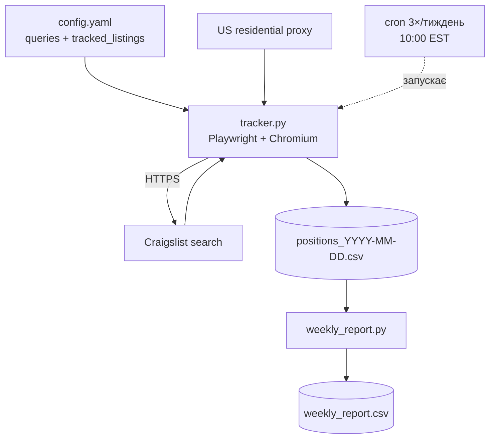
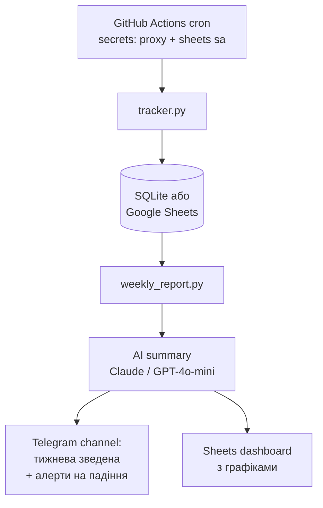

# Архітектура та ризики

## 1. Поточний болючий процес (як це робиться руками)

```
Менеджер ─┬─ вмикає VPN з US-локацією
          ├─ кілька разів на тиждень (Mon / Wed / Fri ~10:00 EST)
          ├─ заходить на craigslist.org → міняє місто
          ├─ вводить запит → переглядає 1-3 сторінки видачі
          ├─ знаходить наші оголошення → виписує позицію в Sheets
          └─ в кінці тижня — зводить тренд руками
```

**Скільки болю:** 3-4 запити × 2-3 міста × ~5 хв на одне × 3 рази на тиждень ≈ **1.5-3 години чистого часу + контекст-світч**. Плюс точність низька — людина забуває фіксувати "немає в видачі" як окремий стан, плюс позиція залежить від того, на якій секунді менеджер відкрив сторінку (Craigslist робить shuffle на свіжих постах).

---

## 2. Цільова архітектура

### Етап 1 — MVP (те, що в цьому репо)



### Етап 2 — після того як MVP підтвердив, що це працює



Що додається:
- **AI-сумарі** — LLM пише natural-language коментар до тренду тижня ("позиція iPhone 15 Pro у NY впала з 4 на 11 — імовірно через 8 нових постів за вчора у тій же категорії; рекомендую перепостити").
- **Telegram-алерти** — реальний пуш, коли позиція впала > N пунктів або оголошення вилетіло з топ-120.
- **Графіки** — Sheets умовним форматуванням або Looker Studio, поверх Sheets.

---

## 3. Ризики та як я б їх знімав

| # | Ризик | Імовірність | Імпакт | Мітигація |
|---|---|---|---|---|
| 1 | Datacenter-IP блокується / показується спотворена видача | висока | високий | Residential US proxy (BrightData, SOAX). Це єдиний робочий шлях. ~$50-150/міс на низькому об'ємі. |
| 2 | Капча на запиті | середня | високий | Знижуємо rate-limit (3 рази/тиждень, не щодня). Якщо все ж з'явилась — пишемо в лог, шлемо алерт менеджеру. Не пробуємо обходити автоматично. |
| 3 | Craigslist змінює DOM-класи | низька-середня | середній | Селектори в одному місці, тримаємо два варіанти (`li.cl-static-search-result` + `li.cl-search-result`). Якщо знайдено 0 карток — алерт у Telegram, ручний review. |
| 4 | Оголошення з однаковими тайтлами в категорії | середня | середній | Спочатку матчимо за **id з URL** (`/d/<slug>/<id>.html`), і тільки якщо id невідомий — fallback на `title_contains`. |
| 5 | Постійне переписування URL Craigslist-ом (внутрішні редиректи) | низька | низький | `wait_until="domcontentloaded"` + явний wait на селектор картки. Якщо за 10с немає карток — пишемо break. |
| 6 | ToS Craigslist (формально проти скрейпінгу) | юридичний | низький-середній | Розумний rate-limit, реалістичний user-agent, ніякого паралелізму з одного IP, ніяких авторизованих сесій. Це задача моніторингу **наших власних** оголошень — фактично self-monitoring. Юридично сірому, але стандартна індустрійна практика. |
| 7 | "Позиція" як метрика суб'єктивна | продуктовий | середній | Узгодити з менеджером: фіксуємо top-N (наприклад, top-120 = сторінка 1) як бінарну метрику + точну позицію всередині. Окремо логуємо `total_seen` — щоб бачити, з якого пулу видана позиція. |
| 8 | LLM-сумарі починає галюцинувати | низька | низький | На етапі 2: temperature 0, прив'язка до конкретних чисел через structured output, лог-аналіз перших 10 запусків перед розсилкою команді. |
| 9 | Secrets витекли в git | низька | високий | `.env` в `.gitignore`. GitHub Actions secrets — для проксі і Sheets service account. Регулярна ротація. |
| 10 | Менеджер забуває оновити config при новому пості | продуктовий | низький | (етап 2) парсимо власний акаунт постера → автоматично знаходимо нові id для tracked_listings. Не робимо в MVP. |

---

## 4. Що НЕ робимо принципово

- Не намагаємось масово створювати пости / накручувати позиції — це за межею моніторингу.
- Не обходимо капчу автоматично. Капча = алерт людині.
- Не паралелимо запити з одного IP — це найшвидший шлях у бан.
- Не зберігаємо персональні дані продавців з чужих оголошень.

---

## 5. Roadmap після MVP

1. **Тиждень 1-2 (це MVP):** скрапер + CSV + локальний cron. Перевіряємо стабільність на 3-5 запитах.
2. **Тиждень 3-4:** Google Sheets інтеграція, GitHub Actions cron з secrets, перші реальні цифри для менеджера.
3. **Тиждень 5-6:** AI-сумарі тижня (LLM → один параграф + рекомендації). Telegram-канал з тижневою зведеною.
4. **Тиждень 7+:** Telegram-алерти на drop, auto-discovery нових оголошень (парсимо акаунт постера), графіки.
